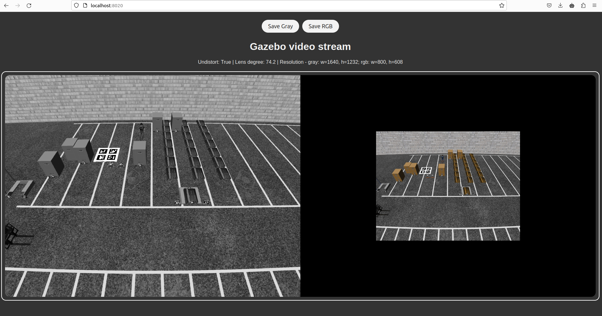

# Calibrate_Camera

use calibrate.py for picam camera or any other camera calibration
image path needs to modified in calibrate.py
name for saved calibration matrices can be set in start of script

calibrate_cam_mp.py is same but uses multiprocessing for image loading but has no visualization of detected markers

default set of images for calibration are located in 
/data/DataBox/Data_New/forklift/calibration_marker/picam_calib/images_1640_1232_C95

# Calibrate gazebo camera
1. Run api with a stream from the selected camera (see gazebo_image_saver.py)

2. Save enough images.
3. Run calibrate_camera.py from the gazebo_calibration file